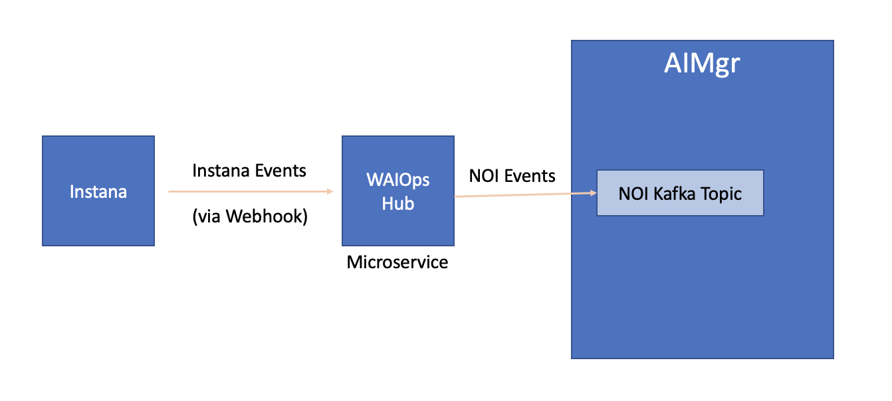
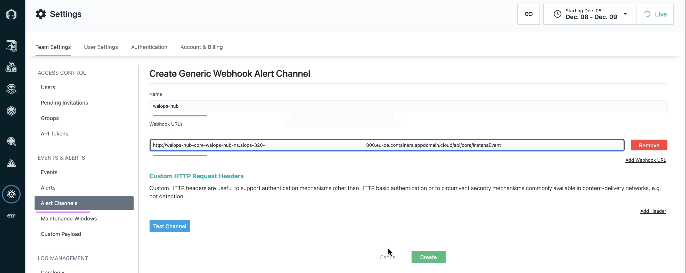
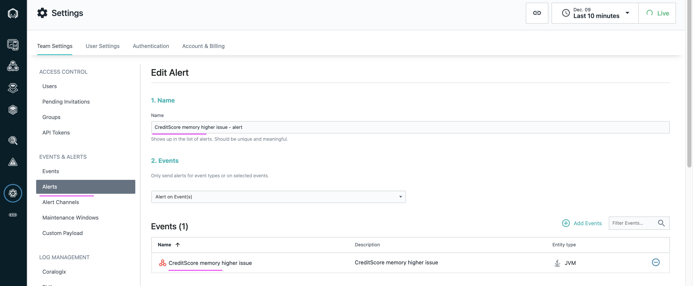
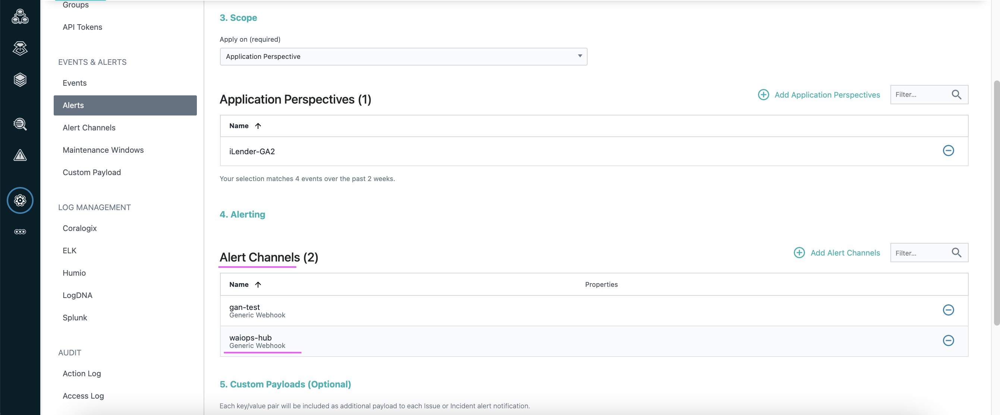
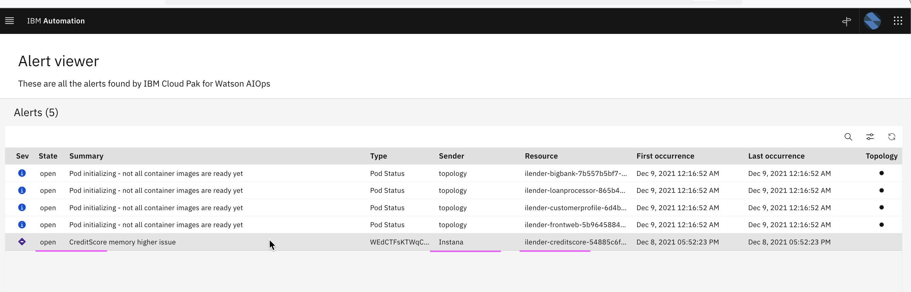

# Sending Instana Events to WAIOps 3.2.0 AIMgr

This document explains about how to send Instana Events directly to WAIOps 3.2.0 AIMgr through Kafka topic.


## 1. Process

1. A Microservice called `WAIOps Hub` to be installed in WAIOps cluster.
2. Instana can send alers to `WAIOps Hub` via Webhook.
3. This `WAIOps Hub` will convert the instana events to NOI events and push the events to NOI Kafka topic in AIMgr.
4. AIMgr will process the event and create Alerts.



## 2. Installation

The `WAIOps Hub` can be installed via the script [files/deploy-waiops-hub.sh](./files/deploy-waiops-hub.sh). Here are the steps.

#### 1. Update NAMESPACE property

In the above script file, update the below property to point to WAIOps AIMgr installed namespace

```
NAMESPACE=cp4waiops
```

#### 2. Update NOI_KAFKA_TOPIC property

Update the below property to point to NOI Kafka topic that is created in AIMgr.

```
NOI_KAFKA_TOPIC=cp4waiops-cartridge-alerts-noi-7buu27a3
```

#### 3. Login into OCP Cluster

Login into the OCP Cluster where WAIOps AIMgr is installed 
```
oc login ....
```

#### 4. Install the WAIOps Hub

Run the script to install the WAIOps Hub microservice.

```
sh files/deploy-waiops-hub.sh
```

As a result, the WebHook url will be printed like the below.

  ===============================================================

WebHook URL : http://waiops-hub-core-waiops-hub-ns.aiops-320-4c84f197-0000.eu-de.containers.appdomain.cloud/api/core/instanaEvent

  ================================================================


#### 5. Create Instana Alert Channel

Create Instana alert channel with webhook and give the above printed url.




#### 6. Create Instana Alert

Create Instana `alert` for the corresponding Event and select the above created `Alert Channel`





#### 7. Generate the event and see the Alert in AIMgr AlertViewer.

Put the load in the application to generate the Instana event and see the event is created as alert in `Alert Viewer`.




#### 8. Sample Events

- Instana Event :  [files/instana-event.json](./files/instana-event.json)
- Converted NOI Event :  [files/noi-event.json](./files/noi-event.json)

## 3. ReInstall and Remove

To reinstall or remove this  `WAIOps Hub`, you can delete the namespace `waiops-hub-ns`.

```
oc delete ns waiops-hub-ns
```

## 4. Note

This is `WAIOps Hub` is intended for POC.


