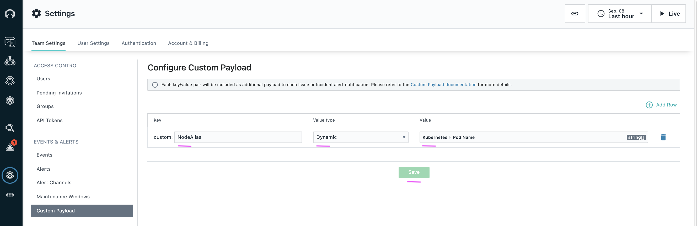
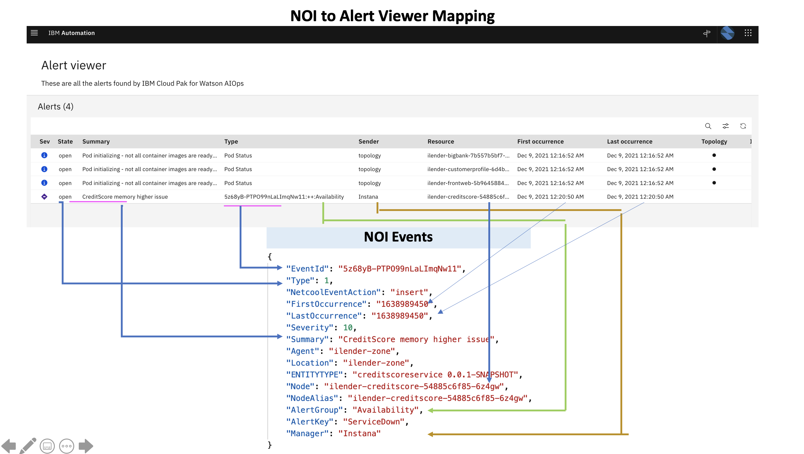

# Sending Instana Events to WAIOps 3.2.0 AIMgr

This document explains about how to send Instana Events directly to WAIOps 3.2.0 AIMgr through Kafka topic.


## 1. Process

1. A Microservice called `WAIOps Hub` to be installed in WAIOps cluster.
2. Instana can send alers to `WAIOps Hub` via Webhook.
3. This `WAIOps Hub` will convert the instana events to NOI events and push the events to NOI Kafka topic in AIMgr.
4. AIMgr will process the event and create Alerts.


## 2. Installation

The `WAIOps Hub` can be installed via the script [files/deploy-waiops-hub.sh](./files/deploy-waiops-hub.sh). Here are the steps.

#### 1. Update NAMESPACE property

In the above script file, update the below property to point to WAIOps AIMgr installed namespace

```
NAMESPACE=cp4waiops
```

#### 2. Update NOI_KAFKA_TOPIC property

Update the below property to point to NOI Kafka topic that is created in AIMgr.

```
NOI_KAFKA_TOPIC=cp4waiops-cartridge-alerts-noi-7buu27a3
```


#### 3. Update Severity Filter property

Update the below property to `true` to apply severity filter.
```
FILTER_SEVERITY_ENABLED=false
```

If the above property is enabled, then update the below properties to process only the instana events that contains the severity in the below range.

```
FILTER_SEVERITY_FROM=1
FILTER_SEVERITY_TO=1000
```

#### 4. Login into OCP Cluster

Login into the OCP Cluster where WAIOps AIMgr is installed 
```
oc login ....
```

#### 5. Install the WAIOps Hub

Run the script to install the WAIOps Hub microservice.

```
sh files/deploy-waiops-hub.sh
```

As a result, the WebHook url will be printed like the below.

  ===============================================================

WebHook URL : http://waiops-hub-core-waiops-hub-ns.aiops-320-4c84f197-0000.eu-de.containers.appdomain.cloud/api/core/instanaEvent

  ================================================================

#### 6. Create Instana Alert Channel

Create Instana alert channel with webhook and give the above printed url.


#### 7. Create Instana Alert

Create Instana `alert` for the corresponding Event and select the above created `Alert Channel`


#### 8. Create Custom Payload for NodeAlias

Create custom payload in Isntana for the NodeAlias field.



More details about this in : https://github.com/ibm-gsi-ecosystem/watson-ai-ops-instana/tree/main/3-custom-payload

#### 9. Generate the event and see the Alert in AIMgr AlertViewer.

Put the load in the application to generate the Instana event and see the event is created as alert in `Alert Viewer`.


-----------
-----------

## 3. Events and Mapping

### 3.1 Events Status : Open

#### Instana Event

- Instana Event :  [files/1-instana-event-open.json](./files/1-instana-event-open.json)

#### NOI Event

- Converted NOI Event :  [files/1-noi-event-open.json](./files/1-noi-event-open.json)

#### Mapping


### 3.2 Events Status : Close

#### Instana Event

- Instana Event :  [files/2-instana-event-close.json](./files/2-instana-event-close.json)

#### NOI Event

- Converted NOI Event :  [files/2-noi-event-close.json](./files/2-noi-event-close.json)

#### Mapping


## 4. NOI Event to Alert Viewer Mapping



## 5. ReInstall and Remove

To reinstall or remove this  `WAIOps Hub`, you can delete the namespace `waiops-hub-ns`.

```
oc delete ns waiops-hub-ns
```

## 6. Note

This is `WAIOps Hub` is intended for POC.


