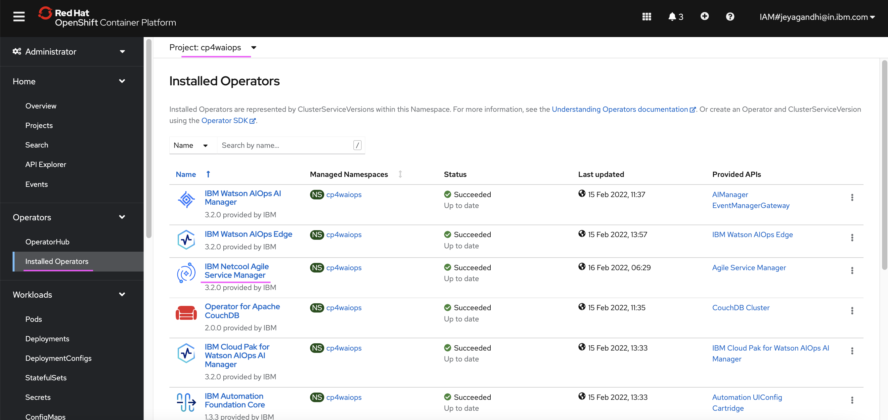
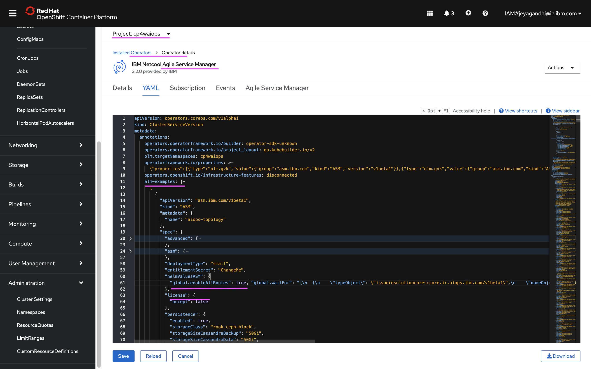

# Topology API

This document explains about how to enable and use API service in Agile Service Manager
(Topology Manager) as part of the IBM Cloud Pak for Watson AIOps.

Note: API service is not officially supported for production.

The article is based on the the following.
- RedHat OpenShift 4.8 on IBM Cloud (ROKS)
- IBM Cloud Pak for Watson AIOps 3.2.0


## 1. Enabling Toplogy Manager API Route

1. Open the web console of the OCP Cluster where WAIOps AIMgr is installed.

2. Open the ASM Operator by doing the following.

- Choose the `Installed Operators` mneu
- Choose the project `cp4waiops`
- Choose `IBM Netcool Agile Service Manager` operator



3. Choose the Yaml tab and the yaml would be like this.



As seen in the image, need to add the below values at the license attribute level. ( `metadata`  > `annotations`  >  `alm-examples`  >  `spec`  > `helmValuesASM`  )

4. Wait for 2 minutes, the routes will start getting created.

## 2. Retrieve Toplogy Manager API access details

A shell script [files/00-print-topology-url-usr-pwd.sh](./files/00-print-topology-url-usr-pwd.sh) is available to print the url and access details of the Topology API.

#### 1. Update NAMESPACE property

In the above script file, update the below property to point to WAIOps AIMgr installed namespace

```
NAMESPACE=cp4waiops
```

#### 2. Login into OCP Cluster

Login into the OCP Cluster where WAIOps AIMgr is installed 
```
oc login ....
```

#### 3. Print the Toplogy Manager API and access details

Run the below script

```
sh files/00-print-topology-url-usr-pwd.sh
```

As a result, Topology API url and access details will be printed like the below.


```
================================================================
TOPO_API_URL=https://aiops-topology-topology-cp4waiops.itzroks-aa-bb-cc.dd.containers.appdomain.cloud/1.0/topology
TOPO_API_URL_SWAGGER=https://aiops-topology-topology-cp4waiops.itzroks-aa-bb-cc.dd.containers.appdomain.cloud/1.0/topology/swagger
TOPO_USER=aiops-topology-cp4waiops-user
TOPO_PWD=aaaaaaaaaaaaaaaa
TOPO_TENENT_ID=cfd95b7e-3bc7-4006-a4a8-a73a79c71255
================================================================
```

## 3. Swagger

The swagger url will be printed as part of the above script. The `TOPO_API_URL_SWAGGER` url to be used for login into swagger.

User, Password and TenantId fields would be used for using swgger web console.

