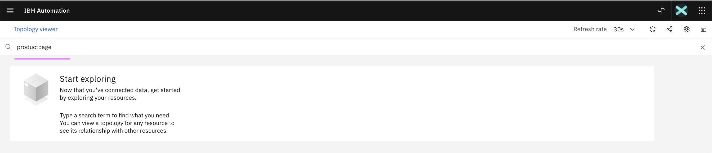
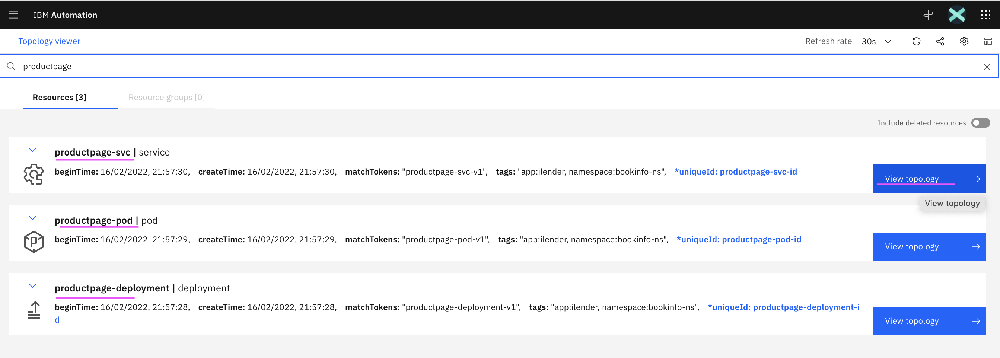
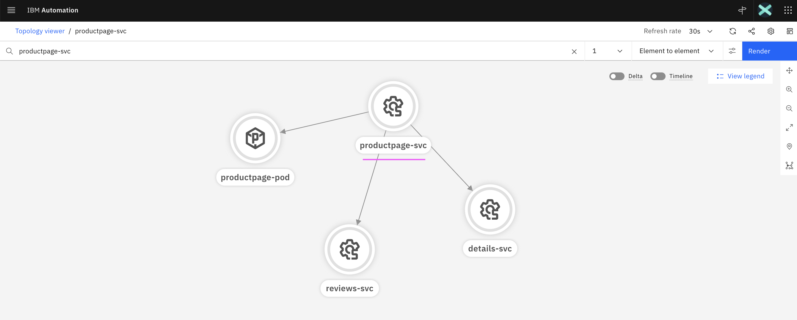
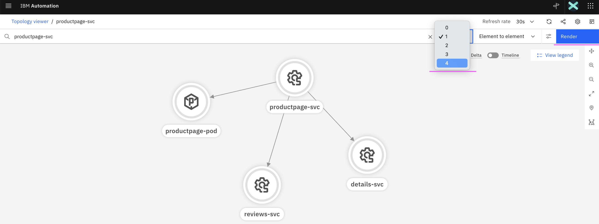
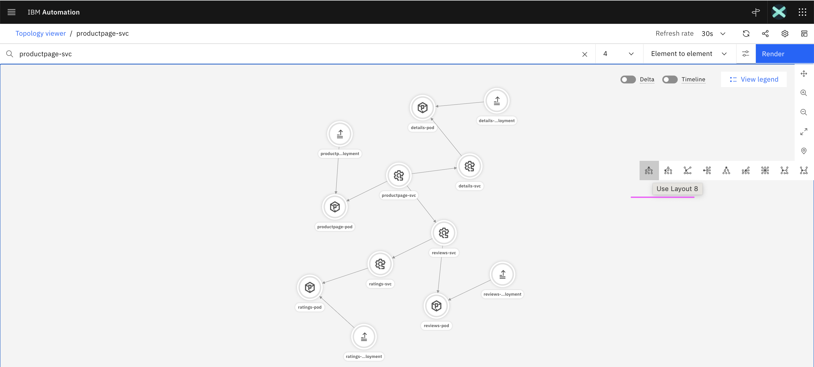
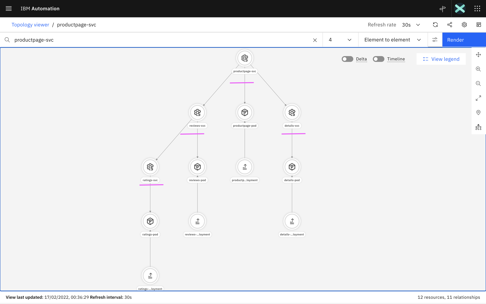
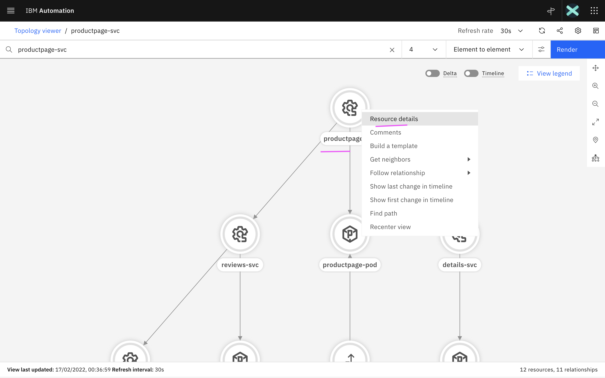
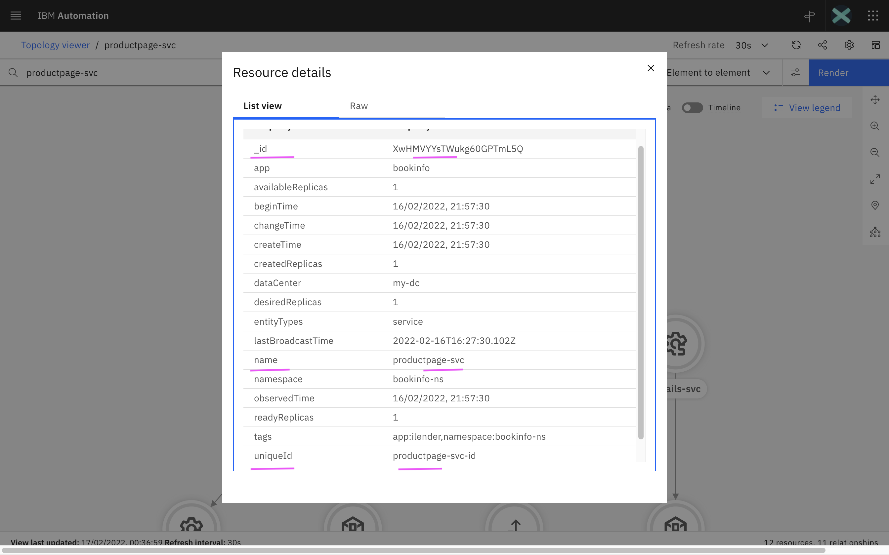

# Topology API

This document explains about how to enable and use API service in Agile Service Manager
(Topology Manager) as part of the IBM Cloud Pak for Watson AIOps.

Note: API service is not officially supported for production.

The following topics are discussed here.

1. Enabling Topology Manager API Route
2. Retrieve Topology Manager API access details
3. Swagger UI
4. Creating Topology for BookInfo App

## 1. Enabling Topology Manager API Route

1. Open the web console of the OCP Cluster where WAIOps AIMgr is installed.

2. Open the ASM Operator by doing the following.

- Choose the `Installed Operators` mneu
- Choose the project `cp4waiops`
- Choose `IBM Netcool Agile Service Manager` operator


3. Choose the Yaml tab and the yaml would be like this.


As seen in the image, need to add the below values at the license attribute level. ( `metadata`  > `annotations`  >  `alm-examples`  >  `spec`  > `helmValuesASM`  )

```
  "helmValuesASM": {
      "global.enableAllRoutes": true"
  },
```

docker run -d -p 8085:8080 somsimulator:latest

4. Wait for 2 minutes, the routes will start getting created.

## 2. Retrieve Topology Manager API access details

A shell script [files/00-print-topology-url-usr-pwd.sh](./files/00-print-topology-url-usr-pwd.sh) is available to print the url and access details of the Topology API.

#### 1. Update NAMESPACE property

In the above script file, update the below property to point to WAIOps AIMgr installed namespace

```
NAMESPACE=cp4waiops
```

#### 2. Login into OCP Cluster

Login into the OCP Cluster where WAIOps AIMgr is installed 
```
oc login ....
```

#### 3. Print the Topology Manager API and access details

Run the below script

```
sh files/00-print-topology-url-usr-pwd.sh
```

As a result, Topology API url and access details will be printed like the below.


```
================================================================
TOPO_API_URL=https://aiops-topology-topology-cp4waiops.itzroks-aa-bb-cc.dd.containers.appdomain.cloud/1.0/topology
TOPO_API_URL_SWAGGER=https://aiops-topology-topology-cp4waiops.itzroks-aa-bb-cc.dd.containers.appdomain.cloud/1.0/topology/swagger
TOPO_USER=aiops-topology-cp4waiops-user
TOPO_PWD=aaaaaaaaaaaaaaaa
TOPO_TENENT_ID=cfd95b7e-3bc7-4006-a4a8-a73a79c71255
================================================================
```

## 3. Swagger UI

The Swagger UI url will be printed as part of the above script. The `TOPO_API_URL_SWAGGER` url to be used to open the Swagger UI.

The above printed User, Password and TenantId fields would be used in Swagger UI.

Swagger UI allows anyone to visualize and interact with the API’s resources. 

## 4. Creating Topology for BookInfo App

The shell scripts to create a BookInfo Application topology using Topology API is available in  [files/scripts-bookinfo](./files/scripts-bookinfo).

### 1. Update Config.sh

Update the below properties in [files/scripts-bookinfo/00-config.sh](./files/scripts-bookinfo/00-config.sh) based on the Topology API url and access details we retrived in the above section. 

```
TOPO_API_URL=https://aiops-topology-topology-cp4waiops.aaaaaaaaaaaaaaaaaaa.containers.appdomain.cloud/1.0/topology
TOPO_TENENT_ID=cfd95b7e-3bc7-4006-a4a8-a73a79c71255
TOPO_USER=aiops-topology-cp4waiops-user
TOPO_PWD=aaaaaaaaaa
```

### 2. Create Topology

1. Get into the folder `./files/scripts-bookinfo` in the cmd line.

2. Run the below 2 files.

```
sh 01-create-topology-entities.sh
sh 02-create-topology-links.sh
```

3. It should have created a bookinof app topology with the below nodes along with thier links.

- productpage
- details
- reviews
- ratings

### 3. Search and View Topology

1. In the topology viewer, enter `productpage` and press `enter` key.



2. The `productpage` related nodes/resources are displayed as below.

Click on `View topology` in `productpage-svc` node.



3. The `productpage-svc` node and its associated nodes with 1 level are displayed



4. Show all the nodes of the bookinfo by doing below

- Change hop level to `4`
- Click on the `Render` button



5. Change the layout style as below.



6. Now the entire topology bookinfo is displayed with the below style.



7. Show the Node/Resource Details by doing below

- Right click on any Node to get the menu
- Click on the `Resource Details` menu to see its detail



8. The `Resource Details` are displayed here.



9. Here property `_id` is autogenerated.

10. Property `uniqueId` can be provided during the node creation.

### 4. Retrieve `_id` using `uniqueId`

We create node using the `uniqueId`. But for further actions like create link, delete node and etc, it requires `_id`. So we can use API to retrive `_id` using `uniqueId`.

Here is the script to retrive `_id` using `uniqueId`

  [files/scripts-bookinfo/03-get-resourceId-by-uniqueId.sh](./files/scripts-bookinfo/03-get-resourceId-by-uniqueId.sh)

The output of the above script could be like this.

```
getResourceIdByUniqueId ---> productpage-svc-id ==> XwHMVYYsTWukg60GPTmL5Q
getResourceIdByUniqueId ---> details-svc-id ==> 7wb8y5KmQTi5e5XDcDPPKA
getResourceIdByUniqueId ---> reviews-svc-id ==> xizKZpDlTNmBXUgDeBcN0g
getResourceIdByUniqueId ---> ratings-svc-id ==> LuR8kuOnTSSmZHqVjSdZEA
```

## 4. Using APIs

### 1. Retrive Resource by uniqueId

Run the below script

```
sh files/00-print-topology-url-usr-pwd.sh
```

As a result, Topology API url and access details will be printed like the below.


Run the below script to 


1. In the topology viewer, enter `productpage` and press `enter` key.


2. The `productpage` related nodes/resources are displayed as below.

Click on `View topology` in `productpage-svc` node.


3. The `productpage-svc` node and its associated nodes with 1 level are displayed


4. Show all the nodes of the bookinfo by doing below

- Change hop level to `4`
- Click on the `Render` button


5. Change the layout style as below.


6. Now the entire topology bookinfo is displayed with the below style.


7. Show the Node/Resource Details by doing below

- Right click on any Node to get the menu
- Click on the `Resource Details` menu to see its detail


8. The `Resource Details` are displayed here.


9. Here property `_id` is autogenerated.

10. Property `uniqueId` can be provided during the node creation.

### 4. Retrieve `_id` using `uniqueId`

We create node using the `uniqueId`. But for further actions like create link, delete node and etc, it requires `_id`. So we can use API to retrive `_id` using `uniqueId`.

Here is the script to retrive `_id` using `uniqueId`

  [files/scripts-bookinfo/03-get-resourceId-by-uniqueId.sh](./files/scripts-bookinfo/03-get-resourceId-by-uniqueId.sh)

The output of the above script could be like this.

```
getResourceIdByUniqueId ---> productpage-svc-id ==> XwHMVYYsTWukg60GPTmL5Q
getResourceIdByUniqueId ---> details-svc-id ==> 7wb8y5KmQTi5e5XDcDPPKA
getResourceIdByUniqueId ---> reviews-svc-id ==> xizKZpDlTNmBXUgDeBcN0g
getResourceIdByUniqueId ---> ratings-svc-id ==> LuR8kuOnTSSmZHqVjSdZEA
```


## Note :

The article is based on the the following.
- RedHat OpenShift 4.8 on IBM Cloud (ROKS)
- IBM Cloud Pak for Watson AIOps 3.2.0
